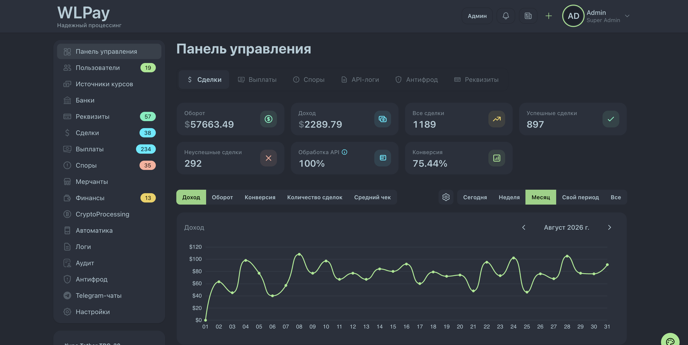

# WLPay — P2P-процессинг для мерчантов и трейдеров

[](https://www.php.net/)
[](https://laravel.com/)
[](https://vuejs.org/)
[](https://www.mysql.com/)
[](https://redis.io/)

**WLPay** — self-hosted платформа, которую можно развернуть на своём сервере для приёма P2P-платежей и проведения выплат. Она соединяет мерчантов с трейдерами, распределяет заявки, ведёт споры, комиссии и расчёты в USDT.



## Для чего нужна платформа

- **Мерчанту** — подключить приём платежей и выплаты через API, видеть статусы операций и получать callback-уведомления.
- **Трейдеру** — управлять реквизитами, лимитами и графиками работы, обрабатывать сделки, выплаты и споры.
- **Команде процессинга** — контролировать пользователей, оборот, доход, комиссии, антифрод, финансы и работу всей площадки из одной панели.

Платформа подходит как основа для собственной P2P-площадки: данные, правила обработки и инфраструктура остаются под контролем владельца.

## Возможности

- приём фиатных P2P-платежей и проведение выплат;
- H2H API для мерчантов, callback-и и журнал запросов;
- кабинеты администратора, мерчанта, трейдера, тимлидера и поддержки;
- распределение заявок по реквизитам трейдеров;
- лимиты, расписания и статистика платёжных реквизитов;
- споры, чеки, банковские выписки и ручная обработка;
- комиссии, внутренние балансы и учёт в USDT;
- пополнение через USDT TRC20;
- антифрод, 2FA, журнал действий и история входов;
- интеграция с Android-приложением, SMS и Telegram;
- очереди, мониторинг и отчёты по работе системы.

## Стек

- **Backend:** PHP 8.3, Laravel 11, Sanctum, Horizon
- **Frontend:** Vue 3, Inertia.js, Vite, Tailwind CSS, DaisyUI
- **Данные:** MySQL 8, Redis
- **Мониторинг:** Laravel Pulse, Telescope, Nightwatch, Sentry

## Требования

- PHP 8.3+ с расширениями `bcmath`, `gmp`, `mbstring`
- Composer
- Node.js 18+ и npm
- MySQL 8+
- Redis

## Быстрый запуск для разработки

```bash
git clone git@github.com:niiikkid/p2p.processing.traders.git
cd p2p.processing.traders

composer install
npm ci
cp .env.example .env
php artisan key:generate
```

Укажите подключение к MySQL и Redis в `.env`, затем выполните:

```bash
php artisan migrate
npm run build
php artisan serve
```

В отдельных процессах запустите очередь и frontend для разработки:

```bash
php artisan horizon
npm run dev
```

> Для рабочего сервера дополнительно нужно настроить веб-сервер, HTTPS, планировщик Laravel, постоянный запуск очередей и все используемые интеграции. Тестовые сидеры создают пользователей с известными паролями — не используйте их в production.

## Основные настройки

Конфигурация хранится в `.env`. Перед запуском проверьте:

- подключение к MySQL и Redis;
- URL приложения и почту;
- токены API и webhook-секреты;
- Telegram-бота;
- Sentry и другие сервисы наблюдения;
- TronGrid для пополнений USDT TRC20;
- параметры мобильного приложения и обработки SMS.

Не добавляйте реальные токены и пароли в Git.

## Связанные проекты

- [P2P App](https://github.com/niiikkid/p2p-app) — Android-приложение для автоматики и обработки SMS.
- [Payment System](https://github.com/niiikkid/payment.system) — связанный криптопроцессинг.

## Поисковые ключи

`P2P payment processing` · `self-hosted P2P platform` · `P2P acquiring` · `merchant payment gateway` · `trader platform` · `merchant API` · `payment orchestration` · `fiat payments` · `USDT processing` · `USDT TRC20` · `P2P payments` · `P2P payouts` · `платформа для мерчантов` · `платформа для трейдеров` · `P2P процессинг` · `приём P2P платежей`
