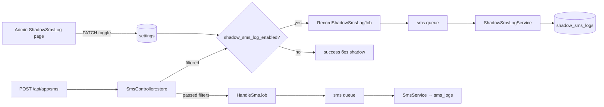

# Shadow SMS Log (Теневой лог) — Implementation Plan

> Sources: User conversation, 2026-05-23; repository exploration, 2026-05-23; implementation status, 2026-05-23
> Raw: [Shadow SMS Log Requirements](../../raw/sms-automation/2026-05-23-shadow-sms-log-requirements.md); [Shadow SMS Log Enable Toggle](../../raw/sms-automation/2026-05-23-shadow-sms-log-enabled-toggle-requirements.md); [Shadow SMS Log Implementation Status](../../raw/sms-automation/2026-05-23-shadow-sms-log-implementation-status.md)
> Updated: 2026-05-23

## Overview

Теневой лог сохраняет SMS/push, которые **отсекаются на входе** API приложения и **никогда не попадают** в `sms_logs`. Это отдельная сущность `ShadowSmsLog` с явной причиной фильтрации и деталями (какое стоп-слово, какой нормализованный отправитель, длина сообщения). Запись асинхронная (очередь `sms`), сбой записи не влияет на ответ приложению и на основной pipeline. Админ видит отдельную страницу в группе «Автоматика», может искать и полностью очистить таблицу вручную. **Фича реализована в коде; миграция БД оставлена к запуску отдельным `php artisan migrate`.**

**Глобальный переключатель** на странице «Теневой лог» включает или выключает запись: при выключении фильтрация на API не меняется, но job в `shadow_sms_logs` не ставится. Настройка хранится в `settings` через `SettingsService`.

## Implementation Status

| Area | Status |
|------|--------|
| Backend entity | Implemented: `ShadowSmsLog`, migration `2026_05_23_013100_create_shadow_sms_logs_table.php` |
| Reason details | Implemented: `ShadowSmsLogFilterReason`, `matched_sender`, `matched_stop_word`, `message_length` |
| Queue write | Implemented: `RecordShadowSmsLogJob` on existing `sms` queue |
| Toggle setting | Implemented: `shadow_sms_log_enabled` in `SettingsService`, default enabled |
| API hook | Implemented in `SmsController::store()` for stop list, stop word, and max length |
| Parser detail | Implemented: `Parser::findMatchedStopWord()` while preserving `hasStopWord()` |
| Admin page | Implemented: `Admin/ShadowSmsLog/Index.vue` |
| Automation navigation | Implemented: shared `AutomationNavButtons` across the automation page group |
| Route/Ziggy refresh | Completed: `php artisan optimize`, `php artisan ziggy:generate ...` |
| Settings install | Completed: `php artisan app:install-settings --no-interaction` |
| Code formatting | Completed: `vendor/bin/pint --dirty --format agent` |
| Tests | Not run; project rule requires explicit request |
| Migration apply | Not run; requires explicit `php artisan migrate` |

## Product Decisions (Locked)

| Topic | Decision |
|-------|----------|
| Точка записи | Только `SmsController::store()` до `HandleSmsJob::dispatch` |
| Причины | `sender_stop_list`, `stop_word`, `max_message_length` |
| Очередь | Существующая `sms` (как `HandleSmsJob`) |
| Сбой записи | Игнорировать (`try/catch` + `report()` опционально) |
| Дубликаты | Допустимы |
| Автоочистка | Нет |
| Удаление | Hard delete всех строк `shadow_sms_logs` |
| Доступ | Только админ |
| UI-группа | 4 страницы: Сообщения, Теневой лог, Приложение, Устройства |
| Поиск логин | `users.email` LIKE |
| Поиск устройство | `user_devices.name` LIKE |
| Поиск sender/message | `shadow_sms_logs.sender` / `message` LIKE |
| Модель / таблица | `ShadowSmsLog` / `shadow_sms_logs` |
| Запись вкл/выкл | Глобальная настройка `shadow_sms_log_enabled` в `settings` |
| UI переключатель | Только страница «Теневой лог» (DaisyUI `toggle`) |
| Default при install | Включено (`1`) |

## Architecture



Основной поток **не читает** `shadow_sms_logs`. Парсер, OpenAI, уведомления и привязка к ордерам не меняются. Стоп-лист и стоп-слова **всегда** отсекают сообщение до `HandleSmsJob` — переключатель влияет **только** на запись в теневую таблицу.

## Existing Code Anchors

| Area | Path |
|------|------|
| API ingress | `app/Http/Controllers/API/APP/SmsController.php` |
| Route | `routes/api.php` — `POST app/sms`, middleware `idempotency_for_app` |
| Validation | `app/Http/Requests/API/SMS/StoreRequest.php` |
| Main job | `app/Jobs/HandleSmsJob.php` → `app/Services/Sms/SmsService.php` |
| Stop word logic | `app/Services/Sms/Parser.php` — `hasStopWord()` |
| Normalization | `app/Services/Sms/Utils/NormalizeMessage.php` |
| Stop list model | `app/Models/SenderStopList.php`, cache `sender_stop_list` |
| Stop words model | `app/Models/SmsStopWord.php`, cache `sms_stop_words` |
| Admin messages | `app/Http/Controllers/Admin/SmsLogController.php`, `resources/js/Pages/SmsLog/Index.vue` |
| Admin app | `resources/js/Pages/Admin/App/Index.vue` |
| Admin devices | `app/Http/Controllers/Admin/UserDeviceController.php`, `resources/js/Pages/Admin/UserDevice/Index.vue` |
| Menu | `resources/js/Layouts/Partials/AdminMenu.vue` — пункт «Автоматика» |
| Filters pattern | `Controller::getTableFilters()`, `TableFiltersValue`, `FiltersPanel` |
| Confirm delete | `ConfirmModal` + `useModalStore` (как стоп-лист на `SmsLog/Index.vue`) |
| Resource example | `app/Http/Resources/SmsLogResource.php` |
| Global settings | `app/Services/Settings/SettingsService.php`, `app:install-settings`, паттерн `traffic_paused` |
| Settings contract | `app/Contracts/SettingsServiceContract.php` |

### Current Filter Order in `SmsController` (must preserve)

1. Device connected (`android_id`) — 401, **не** теневой лог.
2. `mb_strlen(message) > 200` — теневой лог `max_message_length`.
3. Normalize sender → stop list check — теневой лог `sender_stop_list`.
4. Stop word check — теневой лог `stop_word`.
5. `HandleSmsJob::dispatch` — без изменений.

Порядок важен: при длине > 200 не вызывать stop list/stop word (как сейчас — ранний `return`).

## Phase 1 — Database and Domain

### Migration `shadow_sms_logs`

| Column | Type | Notes |
|--------|------|-------|
| `id` | bigint PK | |
| `user_id` | foreignId, indexed | nullable false |
| `user_device_id` | foreignId, indexed | nullable false |
| `sender` | string | raw from API |
| `message` | text | raw from API (до 512 по validation) |
| `timestamp` | unsignedBigInteger or string | как в `sms_logs` (секунды после job: `/1000` в основном логе — **в job передавать raw timestamp из DTO**, в БД хранить так же, как решено для `sms_logs`: string/int из API) |
| `type` | string | `SmsType` value |
| `filter_reason` | string(32), indexed | enum values |
| `matched_sender` | string, nullable | stop list |
| `matched_stop_word` | string, nullable | stop word |
| `message_length` | unsignedInteger, nullable | max length |
| `created_at`, `updated_at` | timestamps | |

Индексы для админ-поиска: `sender` (prefix), при необходимости composite не обязателен на v1.

### Enum `ShadowSmsLogFilterReason`

```php
enum ShadowSmsLogFilterReason: string
{
    case SenderStopList = 'sender_stop_list';
    case StopWord = 'stop_word';
    case MaxMessageLength = 'max_message_length';
}
```

Метод `label(): string` для UI:

| Value | Russian label |
|-------|-----------------|
| `sender_stop_list` | Отправитель в стоп-листе |
| `stop_word` | Стоп-слово |
| `max_message_length` | Превышена длина сообщения |

### Model `ShadowSmsLog`

- `$fillable` — все поля кроме id.
- `casts`: `type` → `SmsType`, `filter_reason` → `ShadowSmsLogFilterReason`.
- Relations: `user()`, `device()` → `UserDevice`.

## Phase 2 — Parser Extension (No Behavior Change)

В `app/Services/Sms/Parser.php`:

- Добавить `findMatchedStopWord(string $message): ?string` — та же логика кеша и regex, что в `hasStopWord()`, но возвращает первое совпавшее слово.
- `hasStopWord()` оставить и делегировать: `return $this->findMatchedStopWord($message) !== null;`

Так `parse()` / `parseAmountFromMessage()` ведут себя как раньше; контроллер вызывает `findMatchedStopWord` только для теневого лога.

## Phase 2b — Global Enable Setting

### Setting key

| Key | Type | Default (`createAll`) | Cache |
|-----|------|----------------------|-------|
| `shadow_sms_log_enabled` | `0` / `1` | `1` (включено) | `settings_shadow_sms_log_enabled`, TTL ~1 min (как `traffic_paused`) |

### `SettingsService`

Добавить по образцу `isTrafficPaused()` / `updateTrafficPaused()`:

```php
const SHADOW_SMS_LOG_ENABLED = 'shadow_sms_log_enabled';
const SHADOW_SMS_LOG_ENABLED_CACHE_KEY = 'settings_shadow_sms_log_enabled';

public function isShadowSmsLogEnabled(): bool
public function updateShadowSmsLogEnabled(bool $enabled): void
```

- `createAll()`: `Setting::firstOrCreate(['key' => ..., 'value' => 1])`.
- После деплоя: `php artisan app:install-settings`.
- Расширить `SettingsServiceContract`.

### Hot path (`SmsController`)

Перед `RecordShadowSmsLogJob::dispatch` в каждой из трёх веток:

```php
if (! services()->settings()->isShadowSmsLogEnabled()) {
    return response()->success();
}
// dispatch shadow job...
```

Фильтрация и `return success()` без job — поведение API для приложения **идентично** включённому режиму.

### Admin API для toggle

```php
Route::patch('/shadow-sms-logs/enabled', [ShadowSmsLogController::class, 'updateEnabled'])
    ->name('shadow-sms-logs.enabled.update');
```

**`updateEnabled(Request $request)`:**

- Validate: `enabled` => `required`, `boolean`.
- `services()->settings()->updateShadowSmsLogEnabled($validated['enabled'])`.
- `return back()` (Inertia).

**`index`:** передать prop `shadowSmsLogEnabled: bool` из `isShadowSmsLogEnabled()`.

## Phase 3 — Write Path (Queue)

### DTO `ShadowSmsLogData` (или массив в job)

Поля для job (serializable):

- `userId`, `userDeviceId`
- `sender`, `message`, `timestamp`, `type` (string value)
- `filterReason` (string enum value)
- `matchedSender`, `matchedStopWord`, `messageLength` (nullable scalars)

### Job `RecordShadowSmsLogJob`

- `ShouldQueue`, queue `sms`, `afterCommit()` по аналогии с `HandleSmsJob` (если когда-либо вызывается внутри транзакции; для SMS сейчас можно без транзакции — всё равно скопировать паттерн).
- `handle()`: `ShadowSmsLogService::create($data)` в `try/catch`; при `\Throwable` — `report($e)` и exit без rethrow.

### Service `ShadowSmsLogService`

```php
public function create(ShadowSmsLogData $data): ShadowSmsLog
```

Один `ShadowSmsLog::create([...])` — без side effects.

### `SmsController` changes

Перед каждым `return response()->success()` в трёх ветках (только если `isShadowSmsLogEnabled()`):

```php
RecordShadowSmsLogJob::dispatch(...);
return response()->success();
```

Если настройка выключена — сразу `return response()->success()` без dispatch.

**Stop list:** `matched_sender` = normalized `$sender`.

**Stop word:** `matched_stop_word` = `(new Parser)->findMatchedStopWord($request->message)`.

**Max length:** `message_length` = `mb_strlen($request->message)`.

Обёртка dispatch в `try/catch` на стороне контроллера **не обязательна**, если job handle уже глотает ошибки; dispatch failure крайне редок — по желанию outer try/catch.

**Не менять:** ответы, ping, кеш-ключи, условие 401.

## Phase 4 — Admin API

### Routes (`routes/web.php`, admin group)

```php
Route::get('/shadow-sms-logs', [ShadowSmsLogController::class, 'index'])->name('shadow-sms-logs.index');
Route::patch('/shadow-sms-logs/enabled', [ShadowSmsLogController::class, 'updateEnabled'])->name('shadow-sms-logs.enabled.update');
Route::delete('/shadow-sms-logs', [ShadowSmsLogController::class, 'destroyAll'])->name('shadow-sms-logs.destroy-all');
```

После добавления: `php artisan optimize` и `php artisan ziggy:generate resources/js/ziggy-routes.js`.

### `ShadowSmsLogController`

**`index`:**

- `getTableFilters()` — расширить `TableFiltersValue` **или** читать `request()->input('filters.*')` локально (предпочтительно расширить value object для консистентности):
  - `login` — string
  - `deviceName` — string
  - `searchSender` — string (или один `search` только для sender — в UI раздельные поля)
  - `searchMessage` — string
- Query:

```php
ShadowSmsLog::query()
    ->with(['user', 'device'])
    ->when($filters->login, fn ($q) => $q->whereHas('user', fn ($u) => $u->where('email', 'like', '%'.$login.'%')))
    ->when($filters->deviceName, fn ($q) => $q->whereHas('device', fn ($d) => $d->where('name', 'like', '%'.$name.'%')))
    ->when($filters->searchSender, fn ($q) => $q->where('sender', 'like', '%'.$sender.'%'))
    ->when($filters->searchMessage, fn ($q) => $q->where('message', 'like', '%'.$message.'%'))
    ->orderByDesc('id')
    ->paginate(request()->per_page ?? 10);
```

- Inertia: `Admin/ShadowSmsLog/Index` + `filters`.
- `smsLogsTotalCount` аналог — `shadowSmsLogsTotalCount` для счётчика «Всего».

**`destroyAll`:**

- `ShadowSmsLog::query()->delete()` (или `truncate()` — delete предпочтительнее с FK).
- `return back()` или redirect на index с flash.

### `ShadowSmsLogResource`

Поля для Vue:

- `id`, `sender`, `message`, `timestamp` (formatted), `type`
- `filter_reason`, `filter_reason_label`
- `matched_sender`, `matched_stop_word`, `message_length`
- `filter_detail_text` — готовая строка для таблицы, например:
  - stop list: `Отправитель: {matched_sender}`
  - stop word: `Слово: {matched_stop_word}`
  - max length: `Длина: {message_length} (лимит 200)`
- `user`: `{ id, email }` — email как «Логин»
- `device`: `{ id, name }`

## Phase 5 — Admin UI

### Shared navigation (4 pages)

На каждой из четырёх страниц в `#button` слоте `MainTableSection` — **три** кнопки на остальные разделы (текущая страница не дублируется). Рекомендуется вынести в `resources/js/Components/Automation/AutomationNavButtons.vue` с prop `current: 'messages' | 'shadow' | 'app' | 'devices'` чтобы не расходились подписи и порядок.

| `current` | Кнопки (слева направо) |
|-----------|-------------------------|
| `messages` | Теневой лог, Приложение, Устройства |
| `shadow` | Сообщения, Приложение, Устройства |
| `app` | Сообщения, Теневой лог, Устройства |
| `devices` | Сообщения, Теневой лог, Приложение |

Маршруты:

- `admin.sms-logs.index`
- `admin.shadow-sms-logs.index`
- `admin.app.index`
- `admin.devices.index`

Обновить файлы:

- `resources/js/Pages/SmsLog/Index.vue`
- `resources/js/Pages/Admin/ShadowSmsLog/Index.vue` (новый)
- `resources/js/Pages/Admin/App/Index.vue`
- `resources/js/Pages/Admin/UserDevice/Index.vue`

### Page `Admin/ShadowSmsLog/Index.vue`

- `MainTableSection`, title «Теневой лог».
- `AutomationNavButtons current="shadow"`.
- **Переключатель записи** (в `#header` или рядом с `#button`, до фильтров):
  - DaisyUI `toggle toggle-primary` + подпись «Запись в теневой лог».
  - `const enabled = ref(page.props.shadowSmsLogEnabled)`.
  - `@change` → `useForm({ enabled: boolean }).patch(route('admin.shadow-sms-logs.enabled.update'), { preserveScroll: true, onFinish: sync from props })`.
  - `:disabled="form.processing"` на toggle.
  - Опционально короткий hint: «При выключении отфильтрованные SMS не сохраняются в теневой лог».
- `FiltersPanel` name `shadow-sms-logs`:
  - `InputFilter` login (placeholder «Логин»)
  - `InputFilter` deviceName («Устройство»)
  - `InputFilter` searchSender («Отправитель»)
  - `InputFilter` searchMessage («Сообщение»)
- Таблица (desktop + mobile cards по образцу `SmsLog/Index.vue`): дата, логин, устройство, sender, message (expand/collapse при длинном тексте — опционально), type badge, причина + detail.
- Кнопка «Удалить всё» → `ConfirmModal` с одной фразой, например: «Удалить все записи теневого лога? Это действие нельзя отменить.»
- `useForm({}).delete(route('admin.shadow-sms-logs.destroy-all'))`, `processing` на кнопке.

### `AdminMenu.vue`

Расширить active class:

```js
route().current('admin.sms-logs.*')
  || route().current('admin.shadow-sms-logs.*')
  || route().current('admin.app.*')
  || route().current('admin.devices.*')
```

## Phase 6 — Table Filters Backend

В `app/ObjectValues/TableFilters/TableFiltersValue.php` добавить опциональные поля:

- `login`, `deviceName`, `searchSender`, `searchMessage` (все `?string`, default `''`)

В `Controller::getTableFilters()` парсить из `filters.login` и т.д.

В `toArray()` отдавать для Inertia session restore.

Имена фильтров 1:1 с `InputFilter name="..."` на Vue.

## Phase 7 — Verification Checklist

### API / write path

- [ ] Sender в стоп-листе → `success`, нет записи в `sms_logs`, есть в `shadow_sms_logs` с `matched_sender` (**при включённой настройке**).
- [ ] Сообщение со стоп-словом → то же, `matched_stop_word` заполнено.
- [ ] Сообщение > 200 символов → `message_length` > 200, reason `max_message_length`.
- [ ] Валидное сообщение → только `sms_logs`, shadow пустой для этого payload.
- [ ] **Настройка выключена** → те же три кейса фильтрации, `success`, **нет** новых строк в `shadow_sms_logs`, `sms_logs` по-прежнему пуст для отфильтрованных.
- [ ] **Настройка включена снова** → новые отфильтрованные снова пишутся; старые строки не удаляются.
- [ ] Остановка worker `sms` → API всё равно `success`; shadow появится после поднятия worker (ожидаемо для queue).

### Admin UI

- [ ] Пагинация и фильтры сохраняются через session (GET reload).
- [ ] Поиск по логину / устройству / sender / message.
- [ ] Toggle «Запись в теневой лог» сохраняет состояние в `settings`, переживает reload.
- [ ] «Удалить всё» очищает только `shadow_sms_logs` (настройка enabled не сбрасывается).
- [ ] Переходы между 4 страницами автоматики.
- [ ] Трейдер не видит роут (403/404 по middleware admin).

### Regression

- [ ] `Parser::hasStopWord` и `parse()` без изменений поведения.
- [ ] Стоп-лист / стоп-слова CRUD на `SmsLog/Index` без изменений.
- [ ] `HandleSmsJob` / уведомления `MessageReceivedNotificationEvent` без изменений.

## File Checklist (Implementation)

| Action | File |
|--------|------|
| Create | `database/migrations/xxxx_create_shadow_sms_logs_table.php` |
| Create | `app/Enums/ShadowSmsLogFilterReason.php` |
| Create | `app/Models/ShadowSmsLog.php` |
| Create | `app/DTO/SMS/ShadowSmsLogData.php` (или value object в Jobs) |
| Create | `app/Services/Sms/ShadowSmsLogService.php` |
| Create | `app/Jobs/RecordShadowSmsLogJob.php` |
| Create | `app/Http/Controllers/Admin/ShadowSmsLogController.php` |
| Create | `app/Http/Resources/ShadowSmsLogResource.php` |
| Modify | `app/Http/Controllers/API/APP/SmsController.php` |
| Modify | `app/Services/Settings/SettingsService.php` |
| Modify | `app/Contracts/SettingsServiceContract.php` |
| Modify | `app/Services/Sms/Parser.php` |
| Modify | `app/ObjectValues/TableFilters/TableFiltersValue.php` |
| Modify | `app/Http/Controllers/Controller.php` (`getTableFilters`) |
| Modify | `routes/web.php` |
| Create | `resources/js/Pages/Admin/ShadowSmsLog/Index.vue` |
| Create | `resources/js/Components/Automation/AutomationNavButtons.vue` (recommended) |
| Modify | `resources/js/Pages/SmsLog/Index.vue` |
| Modify | `resources/js/Pages/Admin/App/Index.vue` |
| Modify | `resources/js/Pages/Admin/UserDevice/Index.vue` |
| Modify | `resources/js/Layouts/Partials/AdminMenu.vue` |

## Risks and Mitigations

| Risk | Mitigation |
|------|------------|
| Рост таблицы без TTL | Ручная очистка; мониторинг размера |
| LIKE-поиск по `message` на больших объёмах | Приемлемо для v1; позже FULLTEXT |
| Двойная проверка stop word (controller + parse) | Только controller пишет shadow; parse не трогаем |
| Очередь `sms` перегружена | Job лёгкий INSERT; тот же supervisor что и парсинг |
| Чтение settings на каждый отфильтрованный SMS | Кеш 1 мин на `isShadowSmsLogEnabled()` |

## See Also

- [Device Connect Snapshot Implementation Plan](../user-devices/device-connect-snapshot-implementation-plan.md) — соседняя фича в группе устройств автоматики.
